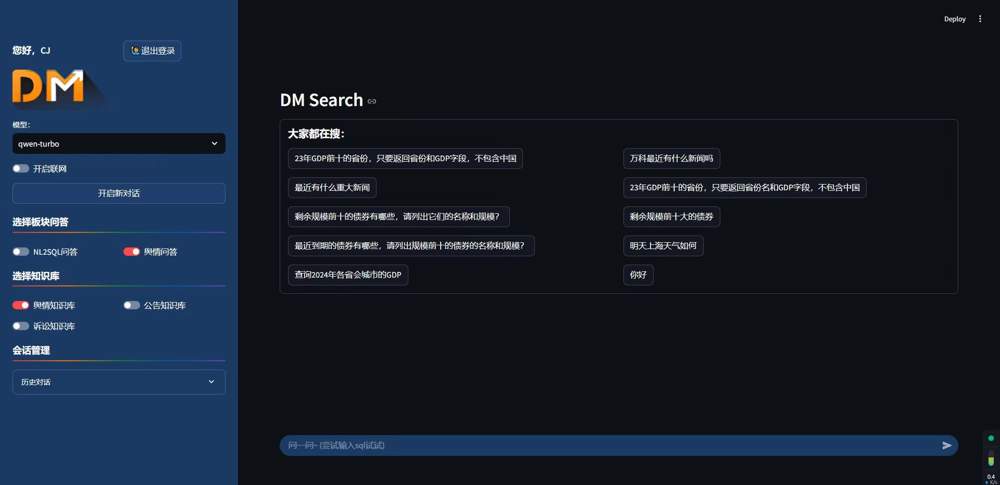

# ai-search
这是一个给公司做的一个搜索项目demo，主要实现了NL2SQL、RAG、问题推荐、和简单的聊天界面，界面包括用户登录、选择知识库、切换模型问答等，所有聊天会话放在MYSQL数据库留档。

### 首页：

### 这是使用体验：

<video width="100%" height="400" controls>
  <source src="preview/使用流程.mp4" type="video/mp4">
</video>

**备注：**

由于这只是一个demo，公司并没有当做正式产品使用，如果有需要源代码的可以联系我

**联系方式：** 635829895@qq.com
